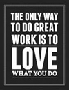
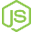
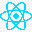
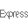

<h4 style="line-height="10"">&nbsp; I am a highly motivated, responsible person who is a fast learner and is attentive to details. I am always looking for improving my coding skills and am open to new challenges.</h4>

<h4> &nbsp; Fun facts about me: I love to code , travel , play table tennis  and chess .
</h4>

🌱 I’m currently looking for a job 

### :mailbox: Contact me:

  
  
  

---

### :hammer_and_wrench: My stack and tools:

<svg fill="none" viewBox="0 0 300 120" width="300" height="120" xmlns="http://www.w3.org/2000/svg">
  <foreignObject width="100%" height="100%">
    

      
      

        
Angular

        
Vue(X)

        
JavaScript

        
TypeScript

      

      

        
(S)CSS

        
Building UIs

        
Web Components

      

      

        
Ionic

        
Electron

        
.NET
     

    

  </foreignObject>
</svg>

<!--
- 🔭 I’m currently working on ...
- 🌱 I’m currently learning ...
- 👯 I’m looking to collaborate on ...
- 🤔 I’m looking for help with ...
- 💬 Ask me about ...
- 📫 How to reach me: galexing@gmail.com
- 😄 Pronouns: ...
- ⚡ Fun fact: ...
-->
